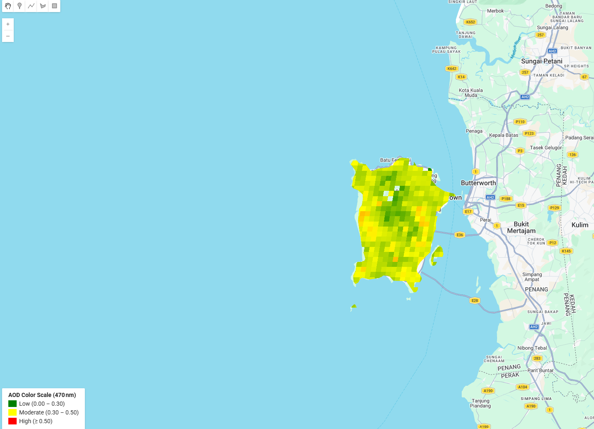
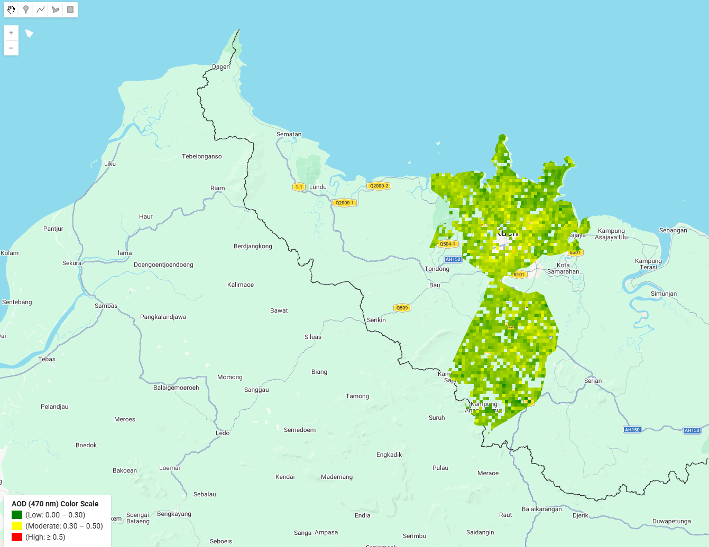

# MODIS AOD GEE Processing for Air Quality Monitoring

Google Earth Engine (GEE) workflows developed for processing and visualizing MODIS MAIAC Aerosol Optical Depth (AOD) data for air quality monitoring in Malaysia.

---

## Project Overview
This repository contains GEE-based scripts used to extract and map MODIS MAIAC AOD data over Penang and Kuching, Sarawak. The workflows support spatial analysis and satellite-derived aerosol monitoring using 470nm and 550nm wavelength observations.

---

## Study Areas
- USM Penang, Pulau Pinang
- Kuching, Sarawak

---

## Objectives
- Extract MODIS AOD values using 3×3 spatial grid analysis
- Generate monthly mean AOD distribution maps
- Visualize aerosol spatial distribution patterns
- Support satellite-based air quality monitoring studies

---

## Data Source
- MODIS MAIAC MCD19A2 Aerosol Optical Depth (AOD)

---

## Tools & Technologies
- Google Earth Engine (GEE)
- Remote Sensing
- Spatial Analysis
- QGIS

## Included Workflows
- MODIS AOD 3×3 Grid Extraction (Penang)
- MODIS AOD 3×3 Grid Extraction (Kuching)
- Monthly Mean MODIS AOD Mapping (470nm)
- Monthly Mean MODIS AOD Mapping (550nm)

---

## Example Outputs

### Penang 470nm AOD Mapping


### Kuching 470nm AOD Mapping


---

## Related Research

This repository forms part of a published undergraduate research project related to satellite-derived air quality monitoring in Malaysia.

### Publication
*Validation of Satellite-Derived Aerosol Optical Depth Using Long-Term Sunphotometer Data in Malaysia.*

### Journal
Journal of Applied Geoscience Technology and Surveying (JAGST), 2025

### DOI
https://doi.org/10.11113/jagst.v5n2.118

---

## Author

**Karthikraajah A/L Nadarajah**  
Bachelor of Science in Geoinformatics (Hons)  
Universiti Teknologi Malaysia (UTM)

---
## Repository Structure

```text
MODIS AOD GEE Processing for Air Quality Monitoring/
│
├── gee_scripts/
│   ├── kuching_470nm_mapping.js
│   ├── kuching_550nm_mapping.js
│   ├── kuching_grid_extraction.js
│   ├── penang_470nm_mapping.js
│   ├── penang_550nm_mapping.js
│   └── penang_grid_extraction.js
│
├── screenshots/
│   ├── kuching_470nm_map.png
│   ├── kuching_550nm_map.png
│   ├── penang_470nm_map.png
│   └── penang_550nm_map.png
│
└── README.md
